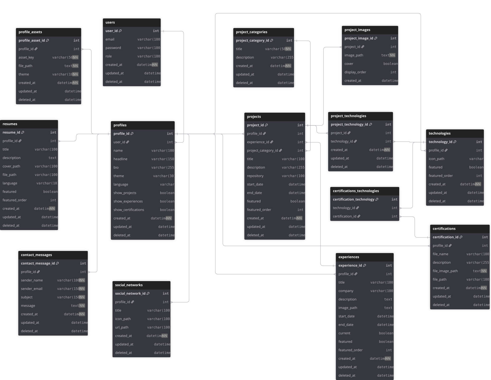

# 02_ARCHITECTURE

## Tech Stack

|  Area | Tecnologíes /  Tools |
| :--- | :--- |
| **Frontend / UI** |    |
| **Backend** |  |
| **Database** |  |
| **Infrastructure** |  |
| **Architecture & Mgmt** |  |

## Database Schema

The database schema is defined using DBML and maintained
in dbdiagram.io.

